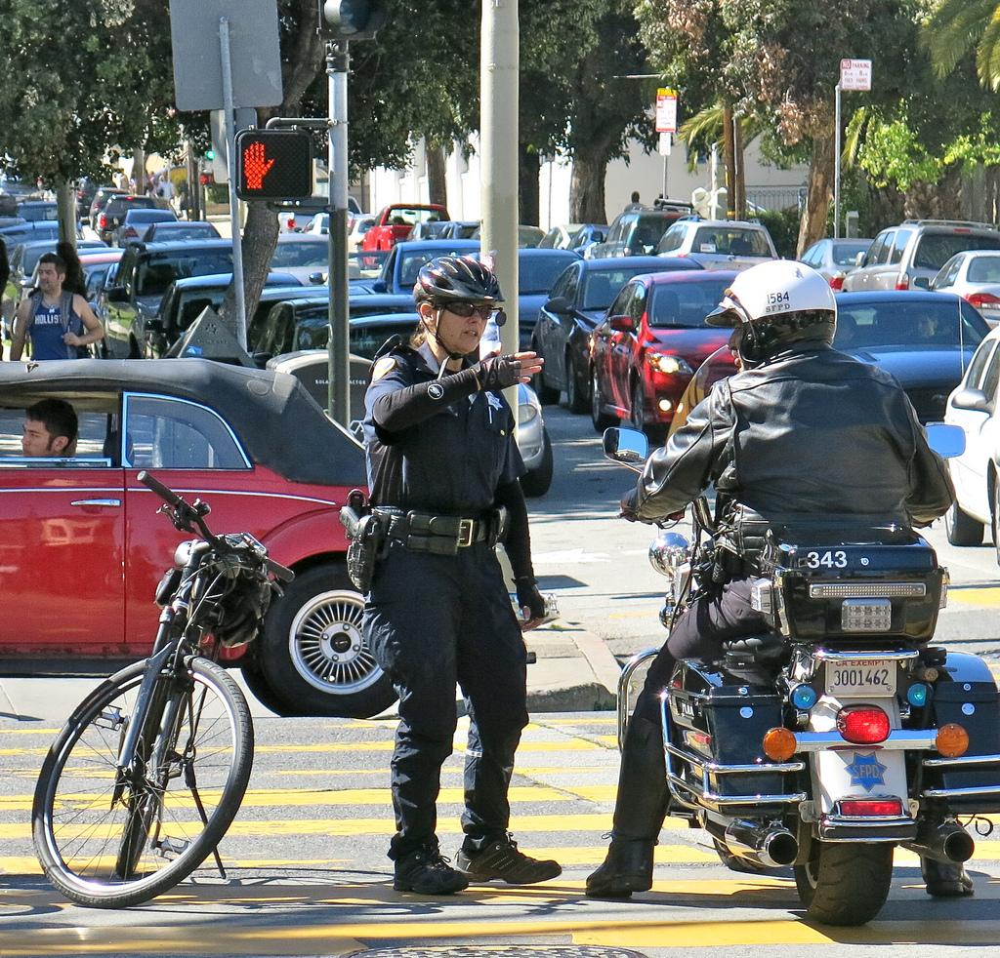

# Visual Relationship Detection

## Getting Started
### Prerequisites
1. Pytorch
2. Keras RetinaNet https://github.com/fizyr/keras-retinanet

### Download the pre-trained weights
https://drive.google.com/file/d/1tZJvOsta6CPIwz5D1ruZGIAncab0Nx2O/view?usp=sharing

### Download the pre-trained weights for Retina Net
https://www.dropbox.com/s/hdwd6qjir032ktj/resnet50_vrd_inference.h5?dl=0

### Download Glove word vectors
https://nlp.stanford.edu/projects/glove/

### Dataset
1) VRD - Download from  https://cs.stanford.edu/people/ranjaykrishna/vrd/
2) Visual Genome (To do)

 
### Training
```
python main.py   --epochs 1000 --gpu 0 --save_interval 5 --dataset_path ./data/vrd --glove_path ./data/glove.6B/glove.6B.300d.txt
```

### Inference
```
python predict.py --dataset_path ./data/vrd --glove_path ./data/glove.6B/glove.6B.300d.txt


```

### Results



## Reference
Visual Relationship Detection with Language prior and Softmax
https://arxiv.org/abs/1904.07798


## License
This project is licensed under the Apache License 2.0


